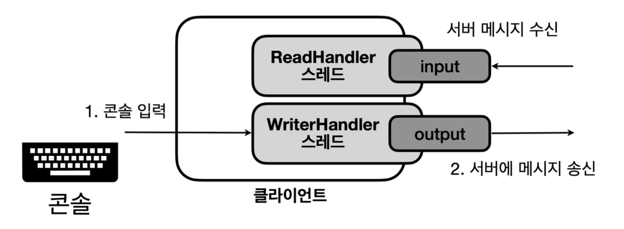
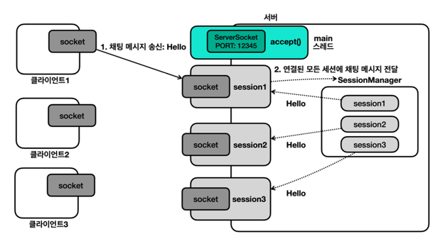

9. 채팅 프로그램

9-1 채팅 프로그램 개발
```html
채팅은 실시간으로 대화를 주고받아야 한다. 그런데 기존에 작성한 네트워크 클라이언트 프로그램은 사용자의 콘솔 입력이 있을 때까지 무한정 대기하는 문제가 있다.
input.readUTF() : 블로킹
scanner.nextLine() : 블로킹
따라서 사용자의 콘솔 입력과 서버로부터 메시지를 받는 부분을 별도의 스레드로 분리해야 한다.
```

```html
서버에서는 모든 세션을 관리해야 한다. 세션 매니저를 활용해야 한다!
```


참고 : 이번 파트는 실습 위주이므로 개념 내용이 별로 없다. 자세한 내용은 강의 자료와 실습 코드를 참고하자
팁 : Null Object Pattern과 Command Pattern을 활용하면 깔끔한 코드를 만들 수 있다.