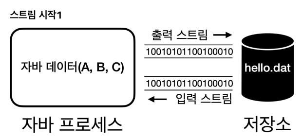
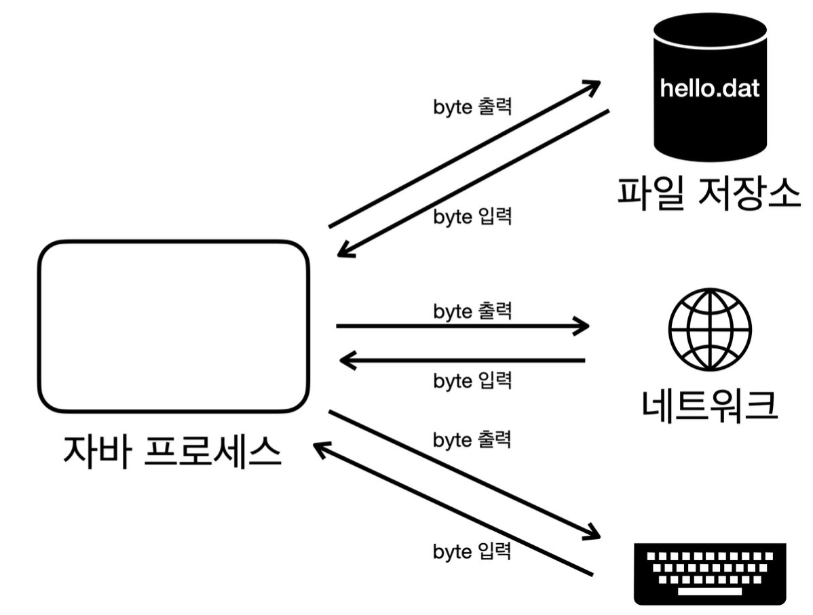
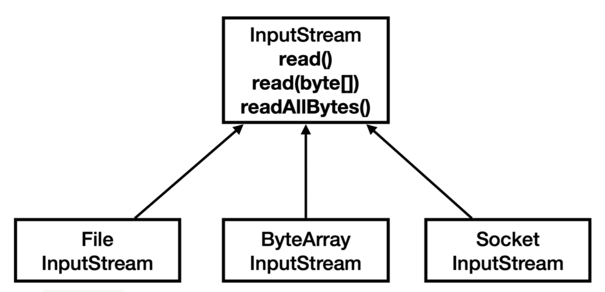
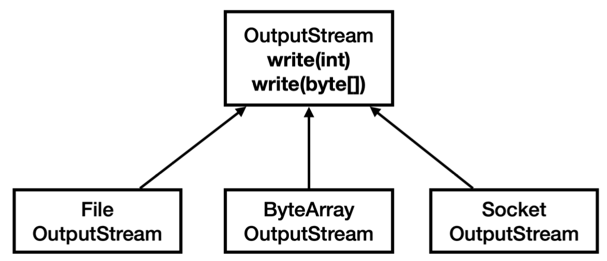

2. I/O 기본1

2-1 스트림

```html
자바가 가진 데이터를 hello.dat파일에 저장하려면 어떻게 해야할까?
자바 프로세스가 가지고 있는 데이터를 밖으로 보내려면 출력 스트림을 사용하고 반대로는 입력 스트림을 사용하면 된다.
스트림은 단방향으로 흐른다.
```java
public class StreamStartMain1 {

public static void main(String[] args) throws IOException {
System.out.println(System.getProperty("user.dir"));
FileOutputStream fos = new FileOutputStream(System.getProperty("user.dir")+"/src/main/java/advanced2/inputoutput2/temp/hello.dat");
fos.write(65);
fos.write(66);
fos.write(67);
fos.close();

FileInputStream fis = new FileInputStream(System.getProperty("user.dir")+"/src/main/java/advanced2/inputoutput2/temp/hello.dat");
System.out.println(fis.read());
System.out.println(fis.read());
System.out.println(fis.read());
System.out.println(fis.read());
fis.close();

}
}
```
new FileOutputStream("temp/hello.dat") : 파일에 데이터를 출력하는 스트림. 폴더는 만들지 않고 파일은 없으면 자동으로 만든다.
write() byte 단위로 값을 출력한다.
new FileInputStream("temp/hellol.dat") : 파일에서 데이터를 읽어오는 스트림이다.
read() 파일에서 데이터를 byte 단위로 하나씩 읽어온다. 파일의 끝에 도달하면 -1을 반환한다.
close() 자바에서 내부 객체는 자동으로 GC가 되지만 외부 자원은 사용 후 반드시 닫아주어야 한다.
파일을 들여다보면 개발툴이나 텍스트 편집기는 UTF-8을 사용해 byte단위의 데이터를 문자로 디코딩해서 보여주기 때문에 문자가 보인다.
read()로 데이터를 읽어오면 숫자가 반환된다.
```
```

2-2 InputStream, OutputStream


```html
현대 컴퓨터는 대부분 byte 단위로 데이터를 주고 받는다. 이렇게 데이터를 주고 받는 것을 I/O라고 한다.
자바 내부에 있는 데이터를 외부 파일에 저장하거나 네트워크를 통해 전송하거나 콘솔에 출력할때 모두 바이트 단위로 데이터를 주고 받는다.
파일,네트워크,콘솔 각각 데이터를 주고 받는 방식이 다르면 상당히 불편할 것이다.
따라서 자바는 InputStream, OutputStream이라는 기본 추상 클래스를 제공한다.
```



2-3 메모리와 콘솔에 사용하는 스트림 사용하기

```java
public class ByteArrayStreamMain {

    public static void main(String[] args) throws IOException {
        byte[] input = {1,2,3};
        ByteArrayOutputStream baos = new ByteArrayOutputStream();
        baos.write(input);

        ByteArrayInputStream bais = new ByteArrayInputStream(baos.toByteArray());
        byte[] bytes = bais.readAllBytes();
        System.out.println(Arrays.toString(bytes));
        
    }
}
```
```html
ByteArrayOutputStream, ByteArrayInputStream을 사용하면 메모리에 스트림을 쓰고 읽을 수 있다.
메모리에 어떤 데이터를 저장하고 읽을 때는 컬렉션이나 배열을 사용하면 되기 때문에 잘 사용하지는 않지만 스트림을 간단하게 테스트하거나 스트림의 데이터를 확인하는 용도로 사용된다.
```

2-4 콘솔 스트림

```java
public class PrintStreamMain {

    public static void main(String[] args) throws IOException {
        PrintStream ps = System.out;
        byte[] bytes = "Hello!\n".getBytes(StandardCharsets.UTF_8);
        ps.write(bytes);
        ps.println("Print!");
        
    }
}
```
```html
PrintStream은 OutputStream을 상속받는다. 자바가 시작될 때 자동으로 만들어지므로 우리가 직접 생성하지 않는다.
정리 : 인풋스트림과 아웃풋스트림이 다양한 스트림들을 추상화하고 기본 기능에 대한 표준을 잡아두었기 때문에 개발자는 편리하게 입출력 작업을 수행할 수 있게 되었다.
일관성, 유연성, 확장성, 재사용성의 이점이 생겼다.
```

2-5 파일 입출력과 성능 최적화1
```html
파일을 효과적으로 더 빨리 읽고 쓰는 방법에 대해 알아보자
우선 1바이트씩 데이터를 전달하면 OS의 시스템 콜을 통해 파일을 읽거나 쓰는데, 이런 작업은 상대적으로 무겁다.
HDD,SDD같은 장치들도 하나의 데이터를 읽고 쓸때마다 필요한 시간이 있다.
따라서 전달하고 받아오는 시간이 많아지므로 느려진다. 운영체제로의 시스템 콜이 발생하고 이 자체가 상당한 오버헤드를 유발한다.
운영체제와 하드웨어가 어느정도 최적화를 제공하더라도 자주 발생하는 시스템 콜로 인한 성능 저하는 피할 수 없게 된다.
결국 자바에서 호출 횟수를 줄여서 시스템 콜 횟수도 줄여야 한다.
-> 많은 데이터를 한번에 전달하면 시스템콜이 줄어들고 장치들의 작동횟수도 줄어든다. 따라서 성능을 최적화 할 수 있다.
다만 버퍼의 크기가 커진다고 해서 속도가 계속 줄어들지는 않는다.
디스크나 파일 시스템에서 데이터를 읽고 쓰는 기본 단위가 4KB 또는 8KB이기 때문이다.
따라서 버퍼의 크기는 보통 4KB, 8KB 정도로 잡는 것이 효율적이다.
```

2-6 Buffered 스트림
```html
BufferedOutputStream은 버퍼 기능을 내부에서 대신 처리해준다. 단순한 코드를 유지하면서 버퍼를 사용하는 이점도 함께 누릴 수 있다.
버퍼의 크기만큼 데이터를 모아서 전달하기 때문에 빠른 속도로 데이터를 처리할 수 있다.
public BufferedOutputStream(OutputStream out) { ... }
public BufferedOutputStream(OutputStream out, int size) { ... }
FileOutputStream과 같이 단독으로 사용할 수 있는 스트림을 기본 스트림이라 한다.
BufferedOutputStream과 같이 단독으로 사용할 수 없고 보조 기능을 제공하는 스트림을 보조 스트림이라 한다.
BufferedXXX 클래스는 모두 동기화 처리되어 있다.
정리 : 
1. 파일의 크기가 크지 않으면 쉽고 빠르게 한번에 처리하자
2. 성능이 중요하고 큰 파일을 나누어 처리해야 한다면 버퍼를 직접 다루자
3. 성능이 중요하지 않고 버퍼 기능이 필요하면 BufferedXXX를 사용하자
BufferedXXX는 동기화 코드가 들어있어서 스레드 안전하지만 약간의 성능 저하가 있다.
```


