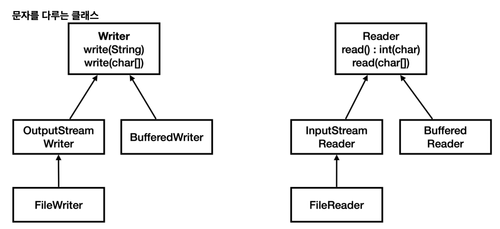

3. IO 기본2

3-1. 문자다루기
```html
String을 byte로 변환활 때는 String.getBytes(Charset)를 사용하고, byte를 String으로 변환할 때는 new String(byte[],UTF_8)를 사용한다.
스트림은 바이트만 사용할 수 있으므로 문자는 직접 전달할 수 없다. 이런 과정을 누군가 대신 처리해주면 편리하지 않을까?
```

3-2. 문자 다루기2 - 스트림을 문자로


```html
OutputStreamWriter : 스트림에 바이트 대신에 문자를 저장할 수 있게 지원한다
InputStreamReader : 스트림에 바이트 대신에 문자를 읽을 수 있게 지원한다.
모든 데이터는 바이트로 저장된다 이 클래스에 문자를 전달하면 결과적으로 내부에서는 지정된 문자 집합을 사용해서 문자를 바이트로 인코딩해서 저장한다.
```

3-3 FileWriter, FileReader
```java
public class ReaderWriterMainV3 {

    public static void main(String[] args) throws IOException {
        String writeString = "ABC";
        System.out.println("write String: " + writeString);

        FileWriter fw = new FileWriter(FILE_NAME, StandardCharsets.UTF_8);
        fw.write(writeString);
        fw.close();

        StringBuilder content = new StringBuilder();
        FileReader fr = new FileReader(FILE_NAME, StandardCharsets.UTF_8);
        int ch;
        while ((ch = fr.read()) != -1) {
            content.append((char) ch);
        }
        fr.close();

        System.out.println("read String: " + content);

    }
}
```
```html
FileWriter는 내부에서 스스로 FileOutputStream을 생성해서 사용한다.
write()를 사용하면 내부에서 인코딩 셋을 사용해서 문자를 바이트로 변경하고 FileOutputStream을 사용해서 파일에 저장한다.
FileReader는 내부에서 스스로 FileInputStream을 생성해서 사용한다. 내부에서 데이터를 바이트 단위로 읽어들이고 문자집합을 사용해서 char로 디코딩한다.
사실 FileWriter는 생성자에서 개발자 대신에 FileOutputStream을 생성해주는 일만 대신 처리해준다.
정리 : `Writer` , `Reader` 클래스를 사용하면 바이트 변환 없이 문자를 직접 다룰 수 있어서 편리하다. 하지만 실제로는 내부
에서 byte로 변환해서 저장한다는 점을 꼭 기억하자. 모든 데이터는 바이트 단위로 다룬다! 문자를 직접 저장할 수는 없 다!
그리고 반드시 기억하자, 문자를 byte로 변경하려면 항상 문자 집합(인코딩 셋)이 필요하다!
참고: 문자 집합을 생략하면 시스템 기본 문자 집합이 사용된다.
```

3-4 BufferedReader, BufferedWriter
```java
public class ReaderWriterMainV4 {
    private static final int BUFFER_SIZE = 8192;

    public static void main(String[] args) throws IOException {
        String writeString = "ABC\n가나다";
        System.out.println("== Write String ==");
        System.out.println(writeString);

        FileWriter fw = new FileWriter(FILE_NAME, StandardCharsets.UTF_8);
        BufferedWriter bw = new BufferedWriter(fw,BUFFER_SIZE);
        bw.write(writeString);
        bw.close();

        StringBuilder content = new StringBuilder();
        FileReader fr = new FileReader(FILE_NAME, StandardCharsets.UTF_8);
        BufferedReader br = new BufferedReader(fr, BUFFER_SIZE);

        String line;
        while ((line = br.readLine()) != null) {
            content.append(line).append("\n");
        }
        br.close();
        System.out.println("== Read String ==");
        System.out.println(content);

    }
}
```
```html
Reader, Writer에도 버퍼 보조 기능을 제공하는 BufferedReader, BufferedWriter가 있다.
BufferedReader는 한 줄로 단위로 문자를 읽는 기능도 추가로 제공한다.
```

3-5. PrintStream, DataOutputStream
```java
public class PrintStreamEtcMain {
    public static void main(String[] args) throws FileNotFoundException {
        FileOutputStream fos = new FileOutputStream("temp/print.txt");
        PrintStream printStream = new PrintStream(fos);
        printStream.println("hello java!");
        printStream.println(10);
        printStream.println(true);
        printStream.printf("hello %s", "world");
        printStream.close();
    }
}
```
```html
PrintStream의 생성자에 FileOutputStream을 전달했다. 이제 이 스트림을 통해서 나가는 출력은 파일에 저장된다.
이 기능을 사용하면 마치 콘솔에 출력하는 것처럼 파일이나 다른 스트림에 문자를 출력할 수 있다.
```
```java
public class DataStreamEtcMain {
    public static void main(String[] args) throws IOException {
        FileOutputStream fos = new FileOutputStream(TextConst.FILE_NAME);
        DataOutputStream dos = new DataOutputStream(fos);

        dos.writeUTF("회원A");
        dos.writeInt(20);
        dos.writeDouble(10.5);
        dos.writeBoolean(true);
        dos.close();
        FileInputStream fis = new FileInputStream(TextConst.FILE_NAME);
        DataInputStream dis = new DataInputStream(fis);
        System.out.println(dis.readUTF());
        System.out.println(dis.readInt());
        System.out.println(dis.readDouble());
        System.out.println(dis.readBoolean());
        dis.close();
    }
}
```
```html
자바 데이터 타입을 사용하면서 회원 데이터를 편리하게 저장하고 불러온다. 다만 꼭 저장한 순서대로 읽어야 한다.
자바에서 int는 4byte로 묶어서 사용한다. 해당 바이트가 그대로 저장되므로 파일에는 글자가 제대로 보이지 않는다.
```

3-6. 정리
```html
기본(기반, 메인) 스트림
- File, 메모리, 콘솔등에 직접 접근하는 스트림
- 단독으로 사용할 수 있음
- 예) `FileInputStream` , `FileOutputStream` , `FileReader` , `FileWriter` ,
`ByteArrayInputStream` , `ByteArrayOutputStream` 

보조 스트림
- 기본 스트림을 도와주는 스트림
- 단독으로 사용할 수 없음, 반드시 대상 스트림이 있어야함
- 예) `BufferedInputStream` , `BufferedOutputStream` , `InputStreamReader` ,
`OutputStreamWriter` , `DataOutputStream` , `DataInputStream` , `PrintStream`
```