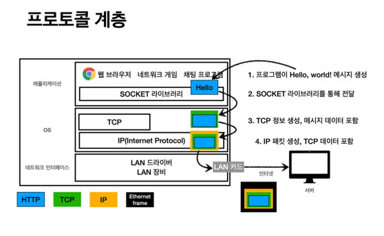
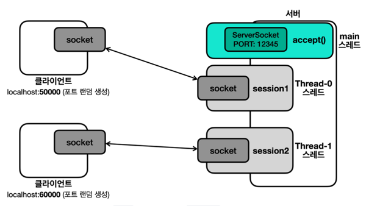

7. 네트워크 프로그램1


```html
네트워크 프로그램을 만들어보자. 여러 사용자가 하나의 서버에 접속해서 채팅할 수 있어야 한다.

```
7-1 예제

```java
public class ServerV3 {

    private static final int PORT = 12345;

    public static void main(String[] args) throws IOException {
        ServerSocket serverSocket = new ServerSocket(PORT);

        while (true) {
            Socket socket = serverSocket.accept();
            SessionV3 session = new SessionV3(socket);
            Thread thread = new Thread(session);
            thread.start();
        }
    }
}
```
```java
public class ClientV3 {


    private static final int PORT = 12345;

    public static void main(String[] args) throws IOException {
        log("Client Start");
        Socket socket = new Socket("localhost", PORT);
        DataInputStream input = new DataInputStream(socket.getInputStream());
        DataOutputStream output = new DataOutputStream(socket.getOutputStream());
        log("Connected to Server: " +socket);
        Scanner scanner = new Scanner(System.in);
        while (true) {
            System.out.print("전송 문자: ");
            String toSend = scanner.nextLine();

            output.writeUTF(toSend);
            log("client -> server: " + toSend);
            if (toSend.equals("exit")) {
                break;
            }
            // 서버로부터 문자 받기
            String received = input.readUTF();
            log("client <- server: " + received);
        }


        input.close();
        output.close();
        socket.close();

    }
}
```
```java
public class SessionV3 implements Runnable {
    private final Socket socket;

    public SessionV3(Socket socket) {
        this.socket = socket;
    }

    @Override
    public void run() {
        try {
            DataInputStream input = new DataInputStream(socket.getInputStream());
            DataOutputStream output = new DataOutputStream(socket.getOutputStream());

            while (true) {
                String received = input.readUTF();
                if (received.equals("exit")) {
                    break;
                }
                String toSend = received + " World!";
                output.writeUTF(toSend);
                log("client <- server: " + toSend);
            }
            // 자원 정리
            log("연결 종료: " + socket);
            input.close();
            output.close();
            socket.close();
        } catch (IOException e) {
            throw new RuntimeException(e);
        }
    }
}
```
```html
클라이언트를 종료하면 에러가 발생한다. 종료시에 예외가 발생하면
서버에서 자원 정리 코드를 호출하지 못하는 점이 생긴다.
이 문제를 해결하기 위해 일단 try-with-resource를 알아보자
```

7-2. try-with-resource

```java
public class ResourceCloseMainV4 {
    public static void main(String[] args) {
        try {
            logic();
        } catch (CallException e) {
System.out.println("CallException 예외 처리"); Throwable[] suppressed = e.getSuppressed(); for (Throwable throwable : suppressed) {
                System.out.println("suppressedEx = " + throwable);
            }
            e.printStackTrace();
        } catch (CloseException e) {
System.out.println("CloseException 예외 처리");
            e.printStackTrace();
        }
}
    private static void logic() throws CallException, CloseException {
        try (ResourceV2 resource1 = new ResourceV2("resource1");
             ResourceV2 resource2 = new ResourceV2("resource2")) {
            resource1.call();
            resource2.callEx(); // CallException;
        } catch (CallException e) {
            System.out.println("ex: " + e);
            throw e; // CallException;
        }
} 
}
```
```html
문제
- close()` 시점에 실수로 예외를 던지면, 이후 다른 자원을 닫을 수 없는 문제 발생
- `finally` 블럭 안에서 자원을 닫을 때 예외가 발생하면, 핵심 예외가 `finally` 에서 발생한 부가 예외로 바뀌
어 버린다. 그리고 핵심 예외가 사라진다.
- resource` 변수를 선언하면서 동시에 할당할 수 없음( `try` , `finally` 코드 블록과 변수 스코프가 다른 문제)
- `catch` 이후에 `finally` 호출, 자원 정리가 조금 늦어진다.
- 개발자가 실수로 `close()` 를 호출하지 않을 가능성
- 개발자가 `close()` 호출 순서를 실수, 보통 자원을 생성한 순서와 반대로 닫아야 함

해결

- `try-with-resource` 사용은 위의 6가지 문제를 모두 해결한다.
- **리소스 누수 방지**: 모든 리소스가 제대로 닫히도록 보장한다. 실수로 `finally` 블록을 적지 않거나, `finally` 블럭 안에서 자원 해제 코드를 누락하는 문제들을 예방할 수 있다.
- **코드 간결성 및 가독성 향상**: 명시적인 `close()` 호출이 필요 없어 코드가 더 간결하고 읽기 쉬워진다.
- **스코프 범위 한정**: 예를 들어 리소스로 사용되는 `resource1,2` 변수의 스코프가 `try` 블럭 안으로 한정된다. 따라서 코드 유지보수가 더 쉬워진다.
- **조금 더 빠른 자원 해제**: 기존에는 try catch finally로 catch 이후에 자원을 반납했다. Try with resources 구분은 `try` 블럭이 끝나면 즉시 `close()` 를 호출한다.
- **자원 정리 순서**: 먼저 선언한 자원을 나중에 정리한다.
- **부가 예외 포함**
    -> 핵심 로직 예외와 부가 예외가 모두 발생하면?
    ->try-with-resources` 는 핵심 예외를 반환한다.
    -> 부가 예외는 핵심 예외안에 `Suppressed` 로 담아서 반환한다.
    -> 개발자는 자원 정리 중에 발생한 부가 예외를 `e.getSuppressed()` 를 통해 활용할 수 있다. 
`try-with-resources` 를 사용하면 핵심 예외를 반환하면서, 동시에 부가 예외도 필요하면 확인할 수 있다.
```
