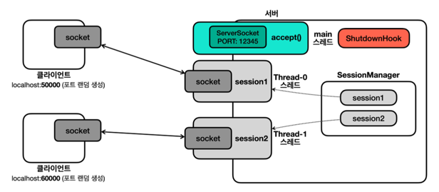
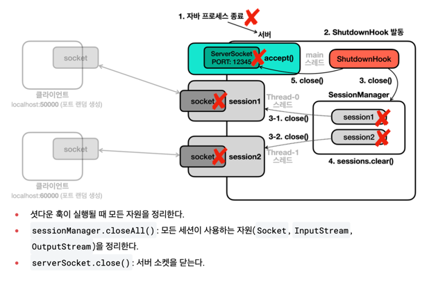

8. 네트워크 - 프로그램2

8-1. 자원정리
```html
자바는 프로세스가 종료될 때 자원 정리나 로그 기록과 같은 종료 작업을 마무리 할 수 있는 셧다운 훅이라는 기능을 제공하낟.
프로세스는 2가지로 분류할 수 있다.

정상 종료
- 모든 non 데몬 스레드의 실행 완료로 자바 프로세스 정상 종료 
- 사용자가 Ctrl+C를 눌러서 프로그램을 중단
- `kill` 명령 전달 (`kill -9` 제외)
- IntelliJ의 stop 버튼

강제 종료
- 운영체제에서 프로세스를 더 이상 유지할 수 없다고 판단할 때 사용
- 리눅스/유닉스의 `kill -9` 나 Windows의 `taskkill /F`

정상 종료의 경우에는 셧다운 훅이 작동해서 필요한 처리를 할 수 있다.
반면 강제 종료는 셧다운 훅이 작동하지 않는다.
```

```html
각 세션은 소켓과 연결 스트림을 가지고 있다. 따라서 서버를 종료할때 사용하는 세션들도 함께 종료해야 한다.
모든 세션을 찾아서 종료하려면 생성한 세션을 보관하고 관리할 객체가 필요하다.
따라서 SessionManager를 만들자
```
```java
package advanced2.network8;

import java.util.ArrayList;
import java.util.List;

public class SessionManagerV6 {

    private List<SessionV6> sessions = new ArrayList<>();

    public synchronized void add(SessionV6 session) {
        sessions.add(session);
    }

    public synchronized void remove(SessionV6 session) {
        sessions.remove(session);
    }

    public synchronized void closeAll() {
        for (SessionV6 session : sessions) {
            session.close();
        }
        sessions.clear();
    }
}

```
```java
package advanced2.network8;

import java.io.DataInputStream;
import java.io.DataOutputStream;
import java.io.IOException;
import java.net.Socket;
import java.util.Scanner;

import static advanced2.network7.MyLogger.log;

public class ClientV6 {


    private static final int PORT = 12345;

    public static void main(String[] args) throws IOException {
        log("Client Start");


        try(Socket socket = new Socket("localhost", PORT);
        DataInputStream input = new DataInputStream(socket.getInputStream());
        DataOutputStream output = new DataOutputStream(socket.getOutputStream())) {
            ;
            log("Connected to Server: " + socket);
            Scanner scanner = new Scanner(System.in);

            while (true) {
                System.out.print("전송 문자: ");
                String toSend = scanner.nextLine();
                output.writeUTF(toSend);
                log("client -> server: " + toSend);
                if (toSend.equals("exit")) {
                    break;
                }
                String received = input.readUTF();
                log("client <- server: " + received);
            }
        } catch (IOException e) {
            log(e);
        }
    }
}

```
```java
package advanced2.network8;

import java.io.IOException;
import java.net.ServerSocket;
import java.net.Socket;

import static advanced1.thread2.MyLogger.log;

public class ServerV6 {

    private static final int PORT = 12345;

    public static void main(String[] args) throws IOException {
        log("서버 시작");
        SessionManagerV6 sessionManager = new SessionManagerV6();
        ServerSocket serverSocket = new ServerSocket(PORT);
        log("서버 소켓 시작 - 리스닝 포트: " + PORT);

        ShutdownHook shutdownHook = new ShutdownHook(serverSocket, sessionManager);
        Runtime.getRuntime().addShutdownHook(new Thread(shutdownHook));
        try {
            while (true) {
                Socket socket = serverSocket.accept();
                SessionV6 session = new SessionV6(socket,sessionManager);
                Thread thread = new Thread(session);
                thread.start();
            }
        } catch (IOException e) {
            log("server socket exited "+e);
        }
    }

    static class ShutdownHook implements Runnable {

        private final ServerSocket serverSocket;
        private final SessionManagerV6 sessionManager;

        public ShutdownHook(ServerSocket serverSocket, SessionManagerV6 sessionManager) {
            this.serverSocket = serverSocket;
            this.sessionManager = sessionManager;
        }

        @Override
        public void run() {
            try {
                sessionManager.closeAll();
                serverSocket.close();
                Thread.sleep(1000);
            } catch (Exception e) {
                e.printStackTrace();
                System.out.println("e = " + e);
            }
        }
    }
}

```
```html
ShutdownHook shutdownHook = new ShutdownHook(serverSocket, sessionManager); 
Runtime.getRuntime().addShutdownHook(new Thread(shutdownHook, "shutdown"));
을 통해 자바 종료시 호출되는 셧다운 훅을 등록할 수 있다.
여기에 셧다운이 발생했을 때 작업과 스레드를 등록하면 된다.
```

```html
비정상 종료의 경우에도 셧다운 훅의 실행이 끝날때 까지는 기다려준다.
셧다운 훅의 실행이 끝나면 non 데몬 스레드의 실행 여부와 상관 없이 자바 프로세스는 종료된다.
따라서 다른 스레드가 자원을 정리하거나 필요한 로그를 남길 수 있도록 셧다운 훅의 실행을 잠시 대기한다.
```

8-2 네트워크 예외 정리
```html
네트워크에서 발생하는 에외는 다양하다. 다 이해하고 다루어야 할까?
따라서 기본적으로 정상 종료, 강제 종료 모두 자원 정리하고 닫도록 설계하자
예를 들어 SocketException, EOFException은 모두 IOException의 자식이다. 따라서 IOException이 발생하면 자원을 정리하자. 더 자세히 분류해야 하면 그때 예외를 구분해서 처리하자.
팁 : 소켓 연결 타임아웃, 리드 타임아웃 설정하자!
```